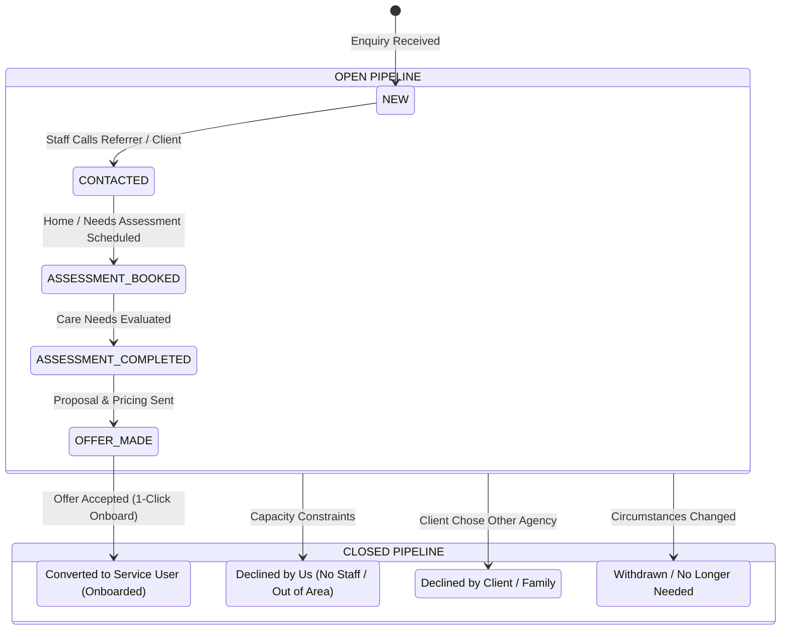

# Enquiries & Referrals Management Module Specification

## 1. Executive Summary & Objectives

The **Enquiries & Referrals Management Module** is designed for the BEERU care management platform to track, manage, and convert prospective clients and incoming referrals. 

### Key Business Goals
* **Capture & Triage**: Record incoming enquiries from prospective clients, family members, social workers, hospital discharge teams, GPs, and local authorities.
* **Separated Pipelines**: Clearly distinguish between **Open** (active leads requiring assessment/follow-up) and **Closed** (converted, declined, or withdrawn) enquiries.
* **Seamless Conversion**: One-click **"Convert to Service User"** feature that automatically creates a `ServiceSeeker` in `PRE_ADMISSION` status, carrying forward all client demographics, contact info, care needs, and funding arrangements without duplicate data entry.
* **CQC & Governance Compliance**: Maintain a full audit trail of referral dates, assessment outcomes, reasons for decline, and communications.

---

## 2. Information Architecture & Navigation

### 2.1 Admin Sidebar Integration (`Sidebar.js`)
A top-level **Enquiries** navigation item placed above or near **Service Users**:

```
[Sidebar]
├── Dashboard
├── Daily Task
├── Rota
├── Enquiries (New)
│   ├── Open Enquiries  ──> /admin/enquiries?tab=open
│   └── Closed Enquiries ──> /admin/enquiries?tab=closed
├── Service Users
...
```

### 2.2 Permissions Integration (`src/lib/permissions.js`)
* `enquiries.view`: Ability to view the enquiries dashboard and records.
* `enquiries.manage`: Ability to create, edit, change stages, add timeline notes, and convert enquiries to Service Users.
* Automatic inheritance for `ADMIN`, `DIRECTOR`, `HR`, and `REGISTER_MANAGER` roles.

---

## 3. Database Schema (`prisma/schema.prisma`)

### 3.1 New Prisma Models

```prisma
// ==========================================
// ENQUIRIES & REFERRALS MANAGEMENT
// ==========================================

enum EnquiryPipeline {
  OPEN
  CLOSED
}

enum EnquiryStatus {
  // OPEN Pipeline Stages
  NEW
  CONTACTED
  ASSESSMENT_BOOKED
  ASSESSMENT_COMPLETED
  OFFER_MADE

  // CLOSED Pipeline Stages
  CONVERTED
  DECLINED_CAPACITY
  DECLINED_CLIENT
  WITHDRAWN
}

enum EnquiryPriority {
  ROUTINE
  URGENT
  EMERGENCY
}

model Enquiry {
  id                    Int              @id @default(autoincrement())
  enquiryNumber         String           @unique // e.g. ENQ-2026-0001
  pipeline              EnquiryPipeline  @default(OPEN)
  status                EnquiryStatus    @default(NEW)
  priority              EnquiryPriority  @default(ROUTINE)

  // 1. Prospective Client Demographics
  firstName             String
  lastName              String
  preferredName         String?
  title                 String?          // Mr, Mrs, Ms, Dr, etc.
  dateOfBirth           DateTime?
  gender                String?
  address               String?          @db.Text
  postalCode            String?
  phone                 String?
  email                 String?

  // 2. Referrer & Contact Source
  enquirerType          String?          // Self, Family Member, Social Worker, Hospital Discharge, GP, Care Coordinator, Other
  contactName           String?          // Name of the person enquiring
  relationshipOrRole    String?          // Daughter, Social Worker, Next of Kin, etc.
  contactPhone          String?
  contactEmail          String?
  organization          String?          // NHS Trust, Council Name, Surgery, etc.

  // 3. Care & Support Requirements
  careType              String?          // Domiciliary Care, Supported Living, Live-In Care, Respite Care, Complex Care, Dementia Care, Night Care
  estimatedHoursPerWeek Float?
  preferredStartDate    DateTime?
  primaryNeeds          String?          @db.Text // Personal care, mobility, medication, companionship, meal prep
  riskFactors           String?          @db.Text // Falls risk, pressure ulcers, dementia wandering, etc.

  // 4. Funding & Financial Details
  fundingType           String?          // Private / Self-Funded, Local Authority, NHS CHC, Direct Payments, Split Funding
  funderName            String?          // Specific council or CCG
  budgetNotes           String?          @db.Text

  // 5. Follow-Up & Staff Assignment
  assignedStaffId       Int?
  assignedStaffName     String?
  followUpDate          DateTime?
  notes                 String?          @db.Text

  // 6. Closure & Conversion Details
  closedReason          String?          @db.Text // Reason if declined or withdrawn
  closedAt              DateTime?
  serviceSeekerId       Int?             // Linked ServiceSeeker ID when converted

  // Timestamps & Audit
  createdAt             DateTime         @default(now())
  updatedAt             DateTime         @updatedAt
  createdById           Int?

  // Relations
  activities            EnquiryActivity[]
  serviceSeeker         ServiceSeeker?   @relation(fields: [serviceSeekerId], references: [id], onDelete: SetNull)

  @@index([pipeline])
  @@index([status])
  @@index([priority])
  @@index([createdAt])
  @@index([serviceSeekerId])
}

model EnquiryActivity {
  id          Int      @id @default(autoincrement())
  enquiryId   Int
  authorId    Int?
  authorName  String?
  type        String   // NOTE, CALL, EMAIL, ASSESSMENT, STATUS_CHANGE, CONVERTED
  title       String?
  content     String   @db.Text
  createdAt   DateTime @default(now())

  enquiry     Enquiry  @relation(fields: [enquiryId], references: [id], onDelete: Cascade)

  @@index([enquiryId])
  @@index([createdAt])
}
```

---

## 4. Pipeline & Workflow Definition



---

## 5. API Endpoints Specification

### 5.1 `GET /api/enquiries`
Retrieves enquiries with filtering, pagination, and KPI counts.

* **Query Parameters**:
  * `pipeline`: `OPEN` | `CLOSED` (defaults to `OPEN`)
  * `status`: specific status filter (e.g. `NEW`, `ASSESSMENT_BOOKED`, `CONVERTED`)
  * `search`: search term across client name, contact name, organization, postcode, phone
  * `careType`: filter by care category
  * `fundingType`: filter by funding stream
  * `page`: integer (default 1)
  * `limit`: integer (default 10)

* **Response Structure**:
```json
{
  "enquiries": [
    {
      "id": 1,
      "enquiryNumber": "ENQ-2026-0001",
      "pipeline": "OPEN",
      "status": "NEW",
      "priority": "URGENT",
      "firstName": "Arthur",
      "lastName": "Pendleton",
      "preferredName": "Artie",
      "dateOfBirth": "1948-06-15T00:00:00.000Z",
      "gender": "Male",
      "address": "42 High Street, Flat 3B",
      "postalCode": "SW1A 1AA",
      "phone": "07700 900123",
      "enquirerType": "Social Worker",
      "contactName": "Rachel Davies",
      "relationshipOrRole": "Care Coordinator",
      "organization": "Westminster Adult Social Care",
      "careType": "Domiciliary Care",
      "estimatedHoursPerWeek": 14,
      "fundingType": "Local Authority",
      "primaryNeeds": "Double-handed transfer, morning & evening personal care, medication prompting.",
      "followUpDate": "2026-09-15T10:00:00.000Z",
      "assignedStaffName": "Sarah Jenkins",
      "createdAt": "2026-09-12T14:30:00.000Z"
    }
  ],
  "stats": {
    "openTotal": 12,
    "closedTotal": 34,
    "newToday": 3,
    "assessmentsPending": 4,
    "urgentCount": 2,
    "convertedTotal": 26,
    "conversionRate": "76.5%"
  },
  "pagination": {
    "total": 12,
    "page": 1,
    "totalPages": 2
  }
}
```

---

### 5.2 `POST /api/enquiries`
Creates a new enquiry record.
* Auto-generates `enquiryNumber` (`ENQ-YYYY-XXXX`).
* Auto-creates initial `EnquiryActivity` record: *"Enquiry logged by [Staff Name]"*.

---

### 5.3 `PUT /api/enquiries/[id]`
Updates enquiry details, assigns staff, or updates status.
* If moving to `CONVERTED`, `DECLINED_CAPACITY`, `DECLINED_CLIENT`, or `WITHDRAWN`: automatically sets `pipeline = CLOSED` and `closedAt = now()`.
* If moved back to an active stage: sets `pipeline = OPEN` and `closedAt = null`.

---

### 5.4 `POST /api/enquiries/[id]/convert` (One-Click Conversion)
Converts an accepted enquiry into a live or pre-admission `ServiceSeeker`.

* **Logic**:
  1. Creates a record in `ServiceSeeker`:
     ```javascript
     const newSeeker = await prisma.serviceSeeker.create({
       data: {
         firstName: enquiry.firstName,
         lastName: enquiry.lastName,
         preferredName: enquiry.preferredName,
         title: enquiry.title,
         dateOfBirth: enquiry.dateOfBirth,
         gender: enquiry.gender,
         address: enquiry.address,
         postalCode: enquiry.postalCode,
         status: 'PRE_ADMISSION', // Ready for full onboarding/admission
       }
     });
     ```
  2. Creates initial `ServiceSeekerContact` (if family/referrer provided).
  3. Creates `ServiceSeekerFunding` (if funding details provided).
  4. Updates the `Enquiry`:
     * `status: 'CONVERTED'`
     * `pipeline: 'CLOSED'`
     * `serviceSeekerId: newSeeker.id`
     * `closedAt: new Date()`
  5. Appends an `EnquiryActivity` logging the conversion and linking the new Service User.
  6. Returns `{ success: true, serviceSeekerId: newSeeker.id }`.

---

### 5.5 `POST /api/enquiries/[id]/activities`
Logs notes, phone calls, or status updates to the enquiry timeline.

---

## 6. Frontend UI / UX Specifications (`/admin/enquiries/page.js`)

### 6.1 Top Header Banner
* Modern indigo/blue brand aesthetic matching BEERU.
* Displays live metric pills:
  * **Open Pipeline**: Total Open, New Leads, Assessments Pending, Urgent Follow-Ups.
  * **Closed Pipeline**: Total Closed, Converted Users, Conversion Rate %.
* Primary action button: **`+ New Enquiry`**.

### 6.2 Pipeline Tabs
* **`Open Enquiries` Tab** (Default, shows badge with count e.g. `12`).
  * Sub-stage filter pills: *All Open | New | Contacted | Assessment Booked | Offer Made*.
* **`Closed Enquiries` Tab** (Shows badge with count e.g. `34`).
  * Sub-stage filter pills: *All Closed | Converted | Declined (Capacity) | Declined (Client) | Withdrawn*.

### 6.3 Search & Filter Toolbar
* Search box: filters on client name, contact name, organization, phone, postcode.
* Filter dropdowns:
  * Care Type (*Domiciliary Care, Supported Living, Live-in, Respite, etc.*)
  * Funding Type (*Private, Local Authority, CHC, Direct Payments*)
  * Priority (*Routine, Urgent, Emergency*)
* View Switcher: **Table View** (structured tabular grid) vs. **Card View** (responsive feed).

### 6.4 Table / Card View Columns & Data
* **Ref / Date**: Reference number, date received, priority pill.
* **Prospective Client**: Full name, preferred name, age/DOB, postcode.
* **Referrer / Contact**: Contact person name, relationship/role, organization.
* **Care & Funding**: Care type pill, weekly hours, funding badge.
* **Stage & Next Action**: Current status badge with instant stage progression dropdown, next follow-up date.
* **Actions**:
  * **View / Details** (opens full timeline modal).
  * **Convert to Service User** (prominent green button for fast onboarding).
  * **Edit** (modify fields).
  * **Close / Decline** (move to closed pipeline with reason).

---

## 7. Form Fields & Intake Template

When recording an enquiry, the form is divided into 5 clean sections:

### Section 1: Prospective Client Details
| Field | Type | Mandatory | Options / Notes |
|---|---|---|---|
| First Name | Text | Yes | - |
| Last Name | Text | Yes | - |
| Title | Select | No | Mr, Mrs, Ms, Miss, Dr, Rev |
| Preferred Name | Text | No | - |
| Date of Birth | Date | No | - |
| Gender | Select | No | Male, Female, Other, Prefer not to say |
| Current Address | Textarea | No | Where the client is currently staying |
| Postal Code | Text | No | UK Postcode (SW1A 1AA) |
| Client Phone | Tel | No | - |
| Client Email | Email | No | - |

### Section 2: Referrer & Contact Source
| Field | Type | Mandatory | Options / Notes |
|---|---|---|---|
| Enquirer / Referrer Type | Select | Yes | Self, Family Member, Social Worker, Hospital Discharge, GP / NHS, Advocate, Other |
| Contact Person Name | Text | Yes | Who made the call / sent referral |
| Relationship / Professional Role | Text | No | Daughter, Next of Kin, Care Manager, etc. |
| Contact Telephone | Tel | Yes | Primary phone to call back |
| Contact Email | Email | No | For sending assessment & care offers |
| Organisation / Surgery / Hospital | Text | No | e.g. Guy's and St Thomas' Hospital, Camden Council |

### Section 3: Care & Support Requirements
| Field | Type | Mandatory | Options / Notes |
|---|---|---|---|
| Care Type Required | Select | Yes | Domiciliary Care, Supported Living, Live-In Care, Respite Care, Complex Care, Dementia Care, Night Care |
| Estimated Weekly Hours | Number | No | e.g. 14 hours / 21 hours |
| Preferred Start Date | Date | No | Target commencement date |
| Primary Care Needs | Textarea | Yes | Description of support (personal care, meals, transfers) |
| Risks & Medical Flags | Textarea | No | Mobility limits, falls history, dementia, PEG feed |

### Section 4: Funding & Financial Arrangements
| Field | Type | Mandatory | Options / Notes |
|---|---|---|---|
| Funding Source | Select | Yes | Private / Self-Funded, Local Authority, NHS Continuing Healthcare (CHC), Direct Payments, Split Funding |
| Funder / Council Name | Text | No | Name of funding authority |
| Budget / Agreed Rate | Text | No | Hourly / weekly rate or indicative package value |

### Section 5: Management & Follow-up
| Field | Type | Mandatory | Options / Notes |
|---|---|---|---|
| Priority Level | Select | Yes | Routine, Urgent, Emergency |
| Assigned Coordinator | Select | No | Care coordinator handling the enquiry |
| Next Follow-Up Date & Time | DateTime | No | Reminder date for next call or visit |
| Initial Notes | Textarea | No | Notes from first discussion |

---

## 8. Implementation Checklist

When you are ready to execute this implementation, follow these exact steps:

1. **Prisma Schema Update**:
   - Add `EnquiryPipeline`, `EnquiryStatus`, `EnquiryPriority`, `Enquiry`, and `EnquiryActivity` to [`prisma/schema.prisma`](file:///e:/Rapidtechpro/bero/prisma/schema.prisma).
   - Add relation `enquiries Enquiry[]` on `ServiceSeeker`.
   - Run `npx prisma db push` to create database tables.
   - Run `npx prisma generate` to update the Prisma client.

2. **Backend API Implementation**:
   - Create `src/app/api/enquiries/route.js` (GET with pipeline filters, POST new enquiry).
   - Create `src/app/api/enquiries/[id]/route.js` (GET, PUT, DELETE).
   - Create `src/app/api/enquiries/[id]/convert/route.js` (Convert to ServiceSeeker).
   - Create `src/app/api/enquiries/[id]/activities/route.js` (Add timeline note/log).

3. **Sidebar & Permissions**:
   - In [`src/lib/permissions.js`](file:///e:/Rapidtechpro/bero/src/lib/permissions.js): Add `enquiries.view` and `enquiries.manage`.
   - In [`src/app/admin/components/Sidebar.js`](file:///e:/Rapidtechpro/bero/src/app/admin/components/Sidebar.js): Add `Enquiries` with sub-items for `Open Enquiries` and `Closed Enquiries`.

4. **Frontend Implementation**:
   - Create `src/app/admin/enquiries/page.js` with:
     - Open vs. Closed tabs
     - Pipeline metric cards
     - Search & filter toolbar
     - Table and card views
     - Add/Edit modal
     - View Details & Timeline modal
     - Convert confirmation modal with direct link to the newly created Service User admission page.
